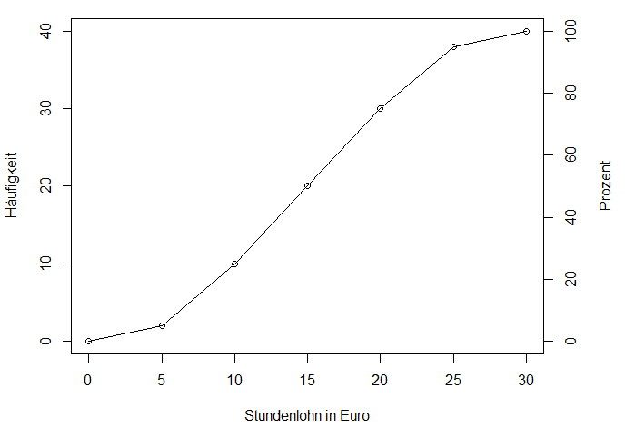

```{r setup, include=FALSE}
knitr::opts_chunk$set(echo = TRUE)
```

## Statistik für Wirtschaftsinformatiker, Übung, HTW Berlin
### Martin Spott, Michael Heimann
Stand: `r format(Sys.Date(), format='%d.%m.%Y')`

## Wiederholung

* Was ist eine Primärerhebung? Was ist eine Sekundärerhebung? Nenne für jede der beiden Erhebungsarten zwei Vorteile, die sie gegenüber der anderen hat.
* Was versteht man unter absoluter bzw. relativer Häufigkeit?
* Warum sind Balkendiagramme im Allgemeinen Kreisdiagrammen vorzuziehen, um Häufigkeitsverteilungen zu visualisieren? 

* Was ist ein Histogramm? Was ist der Unterschied zwischen einem Histogramm und dem Balkendiagramm einer Häufigkeitstabelle?
* Wie wählt man die Gruppen in einem Histogramm?
* Was ist eine kumulierte Verteilung?


## RMarkdown

Der letzten Aufgabe von Aufgabenblatt 2 folgend informiere dich über *RMarkdown* und öffne die Datei `aufgaben_sta_3.Rmd` in RStudio. Dies ist die Quelldatei, aus der in RStudio dieses Übungsblatt generiert wurde. Wir werden zusammen in der Übung sicherstellen, dass alle die Datei in ein HTML- oder PDF-Dokument übersetzen können. 

Bis auf die Handzeichnung eines Balkendiagrammes können alle Aufgaben (textuell oder in R) in diesem Dokument beantwortet werden. So können die Übungsaufgaben dokumentiert werden inklusive persönlicher Kommentare, die beim Wiederholen für die Klausur helfen. Weiterhin werden kommende Übungsblätter auf dem R-Code vorheriger Blätter aufbauen. Speichere also diese Datei regelmäßig während und nach der Bearbeitung.  

## Aufgabe 3.1 (Häufigkeiten)
Ein Hersteller von Smartphonehüllen bietet seine Produkte in verschiedenen Farben an: *hellweiß*, *schwarzmetallic*, *limette*, *orange* und *rot*. Am  Eingang zur IFA 2015 wurden zufällig ausgewählte Besucher nach ihrer bevorzugten  Farbe befragt. Die nachfolgende Tabelle fasst die Ergebnisse der Befragung zusammen.


```{r}
library(knitr)
Farbe <- c("hellweiß", "schwarzmetallic", "limette", "orange", "rot")
Nennung <- c(130, 104, 325, 455, 286)
huellen_farben <- data.frame(Farbe, Nennung)
kable(huellen_farben)
```

a) Um was für eine Tabelle handelt es sich?
Häufigkeitstabelle mit absolute Häufigkeit.

b) Fertige ein entsprechendes Balkendiagramm auf Papier an. 
NEIN

c) Informiere dich über den R-Befehl `barplot()`.
OK

d) Erstelle in R analog zu b) ein Balkendiagramm. Die notwendigen Beschriftungen (Achsen usw.) nicht vergessen!
```{r}
# Specify the colors corresponding to each category
farben_colors <- c("white", "black", "green", "orange", "red")

# Create the barplot using the specified colors
bp <- barplot(height = huellen_farben$Nennung, 
              names = huellen_farben$Farbe, 
              col = farben_colors, 
              ylim = c(0,500),
              main = "Anzahl der Nennungen nach Farbe",
              xlab = "Farbe",
              ylab = "Anzahl der Nennungen")

# Add text labels inside or above the bars
text(bp, huellen_farben$Nennung, labels = huellen_farben$Nennung, pos = 3, cex = 0,5)

```

e) Angenommen, das Unternehmen möchte insgesamt eine Million Hüllen herstellen, wieviel Stück sollten dann von jeder Farbe produziert werden?  

```{r}
library(knitr)
summe_nennungen <- sum(Nennung)

prozentuale_anteile <- Nennung / summe_nennungen

absolute_anzahl <- 1000000 * prozentuale_anteile

# Zweite Variante
f <- prop.table(Nennung)
f * 1000000

ergebnisse <- data.frame(Hüllen_Farbe=Farbe, Herstellungs_anzahl=absolute_anzahl)
kable(ergebnisse)

```

-----

Bei den folgenden Aufgaben arbeiten wir mit dem Applewood-Datensatz von 2011 aus dem Buch *Statistical Techniques in Business and Economics* von Lind/Marchal/Wathen, der aus Autokäufen bei einem Händler namens Applewood resultierte.  Die Datei `Applewood_2011.csv` kann von Moodle heruntergeladen werden. Sie enthält folgende Variablen:

* *Age*: Lebensalter des Käufers in Jahren 
* *Profit*: Gewinn aus dem Verkauf
* *Location*: Niederlassung des Autohauses
* *Vehicle.Type*: Fahrzeugtyp
* *Previous*: Anzahl der vorausgegangenen Käufe bei Applewood

## Aufgabe 3.2 (Applewood)
Importiere die Datei in R und verschaffe dir zunächst einen Überblick  über Umfang und Struktur des Datensatzes. Hierzu stehen unter anderen die folgenden R-Befehle zur Verfügung: `read.csv2()`, `names()`, `dim()`, `str()`, `head()` und `View()`. Beachte, dass `read.csv2()` nur eine spezielle Version von `read.table()` ist. 

a) Was sind die Merkmalsträger? Was ist die Grundgesamtheit?
Merkmalsträger: Einzelne Kunden, für die Daten gesammelt wurden.
Grundgesamtheit: Die Gesamtheit aller Kunden von Applewood, von denen Daten erhoben werden könnten.

b) Betrachte die Merkmale hinsichtlich ihrer Skalen und ordne den Merkmalen die Begriffe qualitativ, quantitativ, diskret und stetig sinnvoll zu. Falls es sich um ein quantitatives Merkmal handelt, hat dieses wenige oder viele Merkmalsausprägungen in den Beobachtungen?

1. **Age (Lebensalter)**:
   - Skala: Quantitativ
   - Merkmalsart: Stetig
   - Anzahl der Merkmalsausprägungen: Viele, 21-73

2. **Profit (Gewinn aus dem Verkauf)**:
   - Skala: Quantitativ
   - Merkmalsart: Stetig
   - Anzahl der Merkmalsausprägungen: 300-3000

3. **Location (Niederlassung des Autohauses)**:
   - Skala: Qualitativ
   - Merkmalsart: Diskret

4. **Vehicle.Type (Fahrzeugtyp)**:
   - Skala: Qualitativ
   - Merkmalsart: Diskret

5. **Previous (Anzahl der vorausgegangenen Käufe bei Applewood)**:
   - Skala: Quantitativ
   - Merkmalsart: Diskret
   - Anzahl der Merkmalsausprägungen: Wenig 0-4

## Aufgabe 3.3 (Applewood)
Informiere dich über die R-Befehle `table()`, `prop.table()` und `cumsum()`. 

a) Erzeuge eine Häufigkeitstabelle für die Variable *Previous* (= Anzahl der vorausgegangenen Verkäufe). Die Tabelle soll die folgenden Informationen enthalten:  

    * Ausprägungen des Merkmals *Previous*
    * absolute Häufigkeit
    * relative Häufigkeit (gerundet auf 3 Stellen hinter dem Komma)
    * kumulierte absolute Häufigkeit
    * kumulierte relative Häufigkeit (gerundet auf 3 Stellen hinter  dem Komma).
    
    Benutze für die Tabelle einen *Data Frame* in R. Aufgabe 1 zeigt ein Beispiel dafür, wie ein Data Frame mit `data.frame()` erzeugt werden kann.  

setwd("C:/Users/PC/Desktop/HTW-Notes/Semester 3/Statistik/data")

```{r}
library(knitr)

setwd("C:/Users/PC/Desktop/HTW-Notes/Semester 3/Statistik/data")
getwd()
data <- read.csv2("Applewood_2011.csv")

# Ausprägungen des Merkmals *Previous*
previous_ausprä <- data$Previous

# absolute Häufigkeit
freq_table <- table(previous_ausprä)
freq_table

# relative Häufigkeit
relative_freq <- prop.table(freq_table)
relative_freq

# kumulierte absolute Häufigkeit
cumulative_freq <- cumsum(freq_table)
cumulative_freq

# kumulierte relative Häufigkeit
cumulative_relative_freq <- cumsum(relative_freq)
cumulative_relative_freq

# *Data Frame* erstelle
freq_df <- data.frame(
  Previous = as.numeric(names(freq_table)),
  Absolute_Frequency = as.numeric(freq_table),
  Relative_Frequency = round(relative_freq, 3),
  Cumulative_Frequency = cumulative_freq,
  Cumulative_Relative_Frequency = round(cumulative_relative_freq, 3)
)

kable(freq_df)
```


b) Erzeuge ein Balkendiagramm für die Ausprägungen der Variable *Previous*.  

```{r}
bp2 <- barplot(freq_table, 
        main = "Häufigkeit der Ausprägungen von Previous",
        xlab = "Previous",
        ylab = "Häufigkeit",
        ylim = c(0,85),
        col = rainbow(nrow(freq_table)))

text(bp2, freq_table, labels = freq_table, pos = 3, cex = 1)
```


## Aufgabe 3.4 (Applewood)
Informiere dich über den R-Befehl `hist()`, um Histogramme zu erzeugen. 

a) Erzeuge ein Histogramm des Merkmals *Profit* mit dem R-Befehl `hist()`. Beschrifte alle Axen und gib dem Diagramm eine Überschrift. 
b) Füge dem Befehl `hist()` aus a) das Argument `freq = FALSE` zu. Vergleiche das erzeugte Histogramm mit dem aus a). Was ist der Unterschied?
c) Variiere die Anzahl der Gruppen mit dem Argument `breaks` und vergleiche die resultierenden Histogramme. 
d) Benutze das Argument `breaks`, um folgende Gruppen zu spezifizieren: (0, 250], (250, 500], ... (2750, 3000], (3000, 3500]. Erzeuge damit ein Histogramm and interpretiere die Höhe der Balken. Wie sind die Höhen der Balken über (2750, 3000] und (3000, 3500] zu vergleichen? Verändere das letzte Intervall von (3000, 3500] zu (3000, 5000]. Erkläre den Unterschied der Ergebnisse.

    Beachte, dass Intervalle wie (0,250] die Null nicht enthalten (runde Klammer), aber 250 schon (eckige Klammer). Wenn R ein Histogramm zeichnet, wird als Standard angenommen, dass die rechte Seite zum Intervall gehört. Das Verhalten kann aber über den Parameter `right = ...` gesteuert werden. Standard ist `right = TRUE`, was man aber auf `right = FALSE` ändern kann, wenn die linke Seite zu den Intervallen gehören soll.  
    
e) Benutze die Funktion `ecdf()`, um die relative kumulierte Häufigkeitsverteilung von *Profit* zu berechnen. Finde heraus, wie man sie mit dem Befehl `plot` als Graphik darstellen kann. Was kann man aus dieser Verteilung ablesen? Gib zwei Beispiele an!

```{r}

# Erstelle das Histogramm mit den spezifizierten Gruppen
hist(data$Profit,
     main = "Frequenz von Profit",
     xlab = "Profit",
     breaks = c(seq(0,3000, 250), 3500))

# Erstelle das Histogramm mit den spezifizierten Gruppen
hist(data$Profit,
     freq = TRUE,
     main = "Frequenz von Profit",
     xlab = "Profit",
     breaks = c(seq(0,3000, 250), 5000))

# Erstelle das Histogramm mit den spezifizierten Gruppen
hist(data$Profit,
     main = "Frequenz von Profit",
     xlab = "Profit",
     breaks = c(seq(0,3000, 250), 5000))

# Berechne die relative kumulative Häufigkeitsverteilung von Profit
ecdf_profit <- ecdf(data$Profit)

# Plotte die relative kumulative Häufigkeitsverteilung
plot(ecdf_profit, main = "Relative kumulierte Häufigkeitsverteilung von Profit",
     xlab = "Profit", ylab = "Kumulierte Häufigkeit")


```


## Aufgabe 3.5 (kumulierte Häufigkeitsverteilung als Polygonzug)
Eine Gruppe von Schweißern wurde im Hinblick auf den Verdienst (Stundenlohn in Euro) untersucht.     Die folgende Abbildung visualisiert die Ergebnisse: 




Beantworte auf der Grundlage dieser Darstellung nachstehende Fragen bzw. vervollständige die Aussagen:

a) Wie viele Personen wurden in die Untersuchung einbezogen? 
40 personen

b) *N* Personen verdienen bis zu 10€ pro Stunde. Bestimme *N*.
10 personen 

c) Rund 75% verdienen bis zu *x* € pro Stunde. Bestimme *x*.
20€

d) 20 der untersuchten Personen verdienen bis zu *y* € pro Stunde. Bestimme *y*. 
15€

